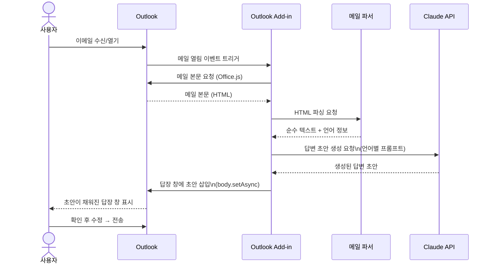
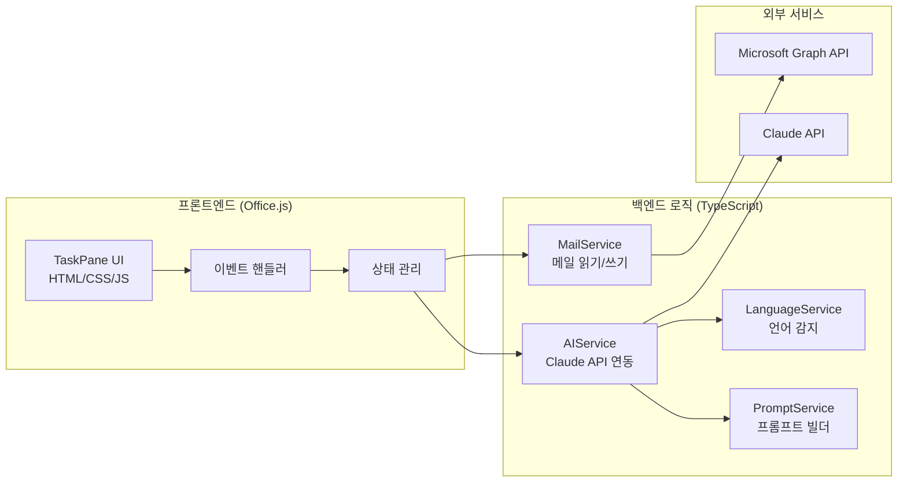
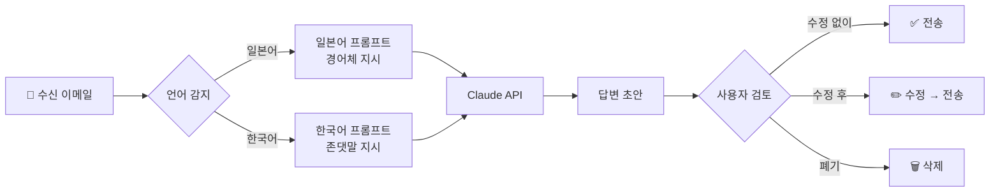

# 🏗️ 아키텍처 문서

**프로젝트**: Outlook AI 답변 자동 초안 생성기
**작성일**: 2026-03-27

---

## 시스템 아키텍처 개요

```mermaid
graph TB
    subgraph Outlook["📧 Microsoft Outlook (Microsoft 365)"]
        MAIL[수신 이메일]
        ADDIN[Outlook Add-in\nOffice.js]
        REPLY[답장 작성 창]
    end

    subgraph ADDIN_LOGIC["🔧 Add-in 로직"]
        PARSER[메일 파서\nHTML → Text]
        LANG[언어 감지\n일본어 / 한국어]
        PROMPT[프롬프트 빌더]
    end

    subgraph CLAUDE["✨ Claude API (Anthropic)"]
        API[claude-sonnet-4-6]
    end

    MAIL -->|메일 본문 읽기\nOffice.js| ADDIN
    ADDIN --> PARSER
    PARSER --> LANG
    LANG --> PROMPT
    PROMPT -->|API 요청| API
    API -->|답변 초안 반환| ADDIN
    ADDIN -->|초안 자동 삽입\nbody.setAsync()| REPLY
```

---

## 상세 시퀀스 다이어그램



---

## 컴포넌트 구조



---

## 데이터 흐름



---

## 보안 고려사항

| 항목 | 처리 방법 |
|------|----------|
| API 키 관리 | 환경변수로 관리, 코드에 하드코딩 금지 |
| 메일 내용 저장 | API 처리 후 즉시 폐기, 로컬 저장 없음 |
| 전송 암호화 | HTTPS/TLS 통신 |
| 인증 | Microsoft 365 OAuth 2.0 |

---

## 폴더 구조

```
outlook-ai-reply/
├── src/
│   ├── taskpane/          # UI 컴포넌트 (HTML/CSS/JS)
│   │   ├── taskpane.html
│   │   ├── taskpane.css
│   │   └── taskpane.ts
│   ├── services/
│   │   ├── mailService.ts      # 메일 읽기/쓰기
│   │   ├── languageService.ts  # 언어 감지
│   │   ├── aiService.ts        # Claude API
│   │   └── promptService.ts    # 프롬프트 관리
│   └── utils/
│       └── htmlParser.ts       # HTML → Text 변환
├── manifest.xml            # Office Add-in 매니페스트
├── .env                    # API 키 (git 제외)
├── package.json
└── README.md
```
