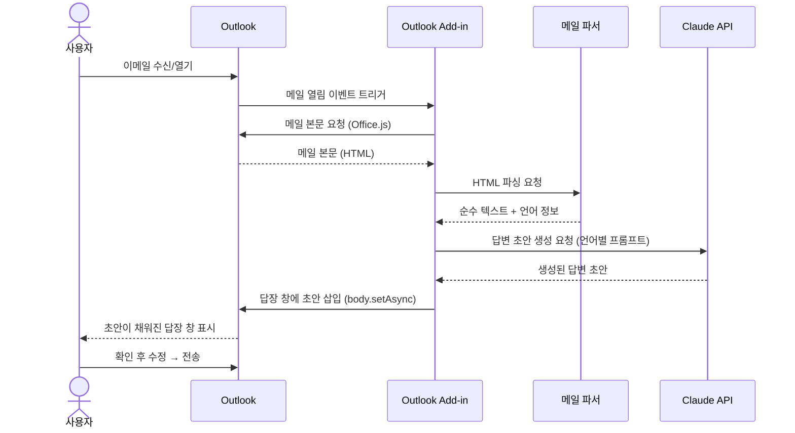
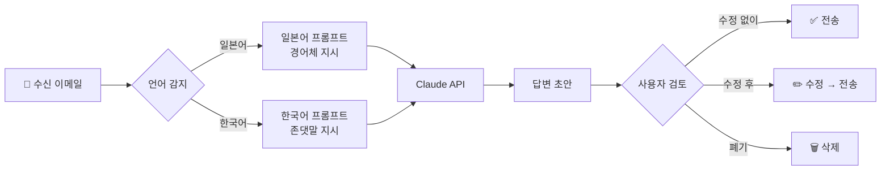
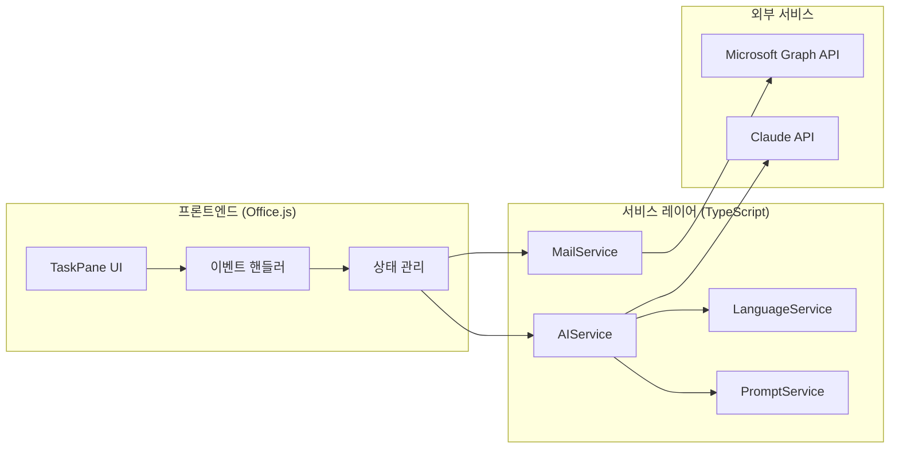

# Outlook AI 답변 자동 초안 생성기 — 개발자 가이드

> **프로젝트명**: Outlook AI Reply Assistant
> **버전**: v1.0
> **최종 수정**: 2026-03-27
> **담당**: 貞善 (kahn@directcloud.co.jp)

---

## 목차

1. [프로젝트 개요](#1-프로젝트-개요)
2. [기술 스택](#2-기술-스택)
3. [시스템 아키텍처](#3-시스템-아키텍처)
4. [기능 명세 (PRD 요약)](#4-기능-명세-prd-요약)
5. [폴더 구조](#5-폴더-구조)
6. [환경 설정 및 설치](#6-환경-설정-및-설치)
7. [핵심 모듈 명세](#7-핵심-모듈-명세)
8. [Claude API 프롬프트 설계](#8-claude-api-프롬프트-설계)
9. [Office.js 연동 가이드](#9-officejs-연동-가이드)
10. [개발 계획 및 이슈 트래킹](#10-개발-계획-및-이슈-트래킹)
11. [테스트 가이드](#11-테스트-가이드)
12. [배포 가이드](#12-배포-가이드)

---

## 1. 프로젝트 개요

### 배경

Microsoft 365 Outlook 사용자가 하루 10~30통의 이메일(한국어/일본어 혼용)을 처리하면서, 매번 답변을 수동으로 작성하는 데 많은 시간과 에너지가 소요된다는 문제를 해결하기 위한 프로젝트.

### 솔루션

Outlook Add-in 형태로 동작하며, 수신 이메일을 Claude API로 분석하여 적절한 답변 초안을 생성하고 Outlook 답장 창에 자동으로 삽입한다.

### 핵심 가치

- 이메일 답변 작성 시간 **70% 이상 단축** 목표
- 언어(한국어/일본어) **자동 감지** 및 동일 언어 답변 생성
- 사용자가 **최소한의 수정**으로 전송 가능한 품질의 초안 제공

---

## 2. 기술 스택

| 레이어 | 기술 | 버전 | 용도 |
|--------|------|------|------|
| Add-in 프레임워크 | Office.js | 최신 | Outlook 연동 |
| 언어 | TypeScript | 5.x | 타입 안전성 |
| AI API | Claude API | claude-sonnet-4-6 | 답변 초안 생성 |
| SDK | @anthropic-ai/sdk | 최신 | Claude API 클라이언트 |
| 번들러 | webpack | 5.x | 빌드 |
| 테스트 | Jest | 29.x | 단위/통합 테스트 |
| 환경설정 | dotenv | - | API 키 관리 |

---

## 3. 시스템 아키텍처

### 전체 구조

```mermaid
graph TB
    subgraph Outlook["📧 Microsoft Outlook (Microsoft 365)"]
        MAIL[수신 이메일]
        ADDIN[Outlook Add-in\nOffice.js]
        REPLY[답장 작성 창]
    end

    subgraph ADDIN_LOGIC["🔧 Add-in 로직"]
        PARSER[메일 파서\nHTML → Text]
        LANG[언어 감지\n일본어 / 한국어]
        PROMPT[프롬프트 빌더]
    end

    subgraph CLAUDE["✨ Claude API (Anthropic)"]
        API[claude-sonnet-4-6]
    end

    MAIL -->|메일 본문 읽기\nOffice.js| ADDIN
    ADDIN --> PARSER
    PARSER --> LANG
    LANG --> PROMPT
    PROMPT -->|API 요청| API
    API -->|답변 초안 반환| ADDIN
    ADDIN -->|초안 자동 삽입\nbody.setAsync()| REPLY
```

### 시퀀스 다이어그램



### 데이터 흐름



### 컴포넌트 의존성



---

## 4. 기능 명세 (PRD 요약)

### 기능 요구사항

| ID | 기능 | 우선순위 | 설명 |
|----|------|---------|------|
| F1 | 이메일 자동 감지 및 분석 | 🔴 High | 새 메일 수신 시 자동으로 내용 분석, 이메일 유형 분류 |
| F2 | 언어 자동 감지 | 🔴 High | 한국어/일본어 자동 판별, 동일 언어로 초안 생성 |
| F3 | AI 답변 초안 생성 | 🔴 High | Claude API 활용, 핵심 요청사항 반영, 경어체 자동 적용 |
| F4 | Outlook 자동 입력 | 🔴 High | 답장 창에 초안 자동 삽입 (`body.setAsync`) |
| F5 | 사용자 설정 | 🟡 Medium | 자동 생성 ON/OFF, 서명 설정, 사용자 정보 |
| F6 | 재생성 기능 | 🟡 Medium | 마음에 들지 않을 경우 다시 생성 |

### 비기능 요구사항

| 항목 | 목표값 |
|------|--------|
| 응답 속도 | 초안 생성 5초 이내 |
| 언어 감지 정확도 | 98% 이상 |
| 지원 언어 | 한국어, 일본어 |
| 호환 환경 | Microsoft 365 Outlook (Windows/Mac) |
| 보안 | 메일 내용 API 처리 후 즉시 폐기, 로컬 저장 없음 |

### MVP 범위

**포함:**
- Claude API 연동 답변 초안 생성
- 한국어/일본어 자동 감지
- Outlook Add-in 버튼 클릭 시 초안 생성 및 삽입

**MVP 제외 (추후 고려):**
- 메일 수신 시 완전 자동 생성
- 사용자별 커스텀 톤/스타일 학습
- 과거 대화 맥락 반영

---

## 5. 폴더 구조

```
outlook-ai-reply/
├── src/
│   ├── taskpane/                   # UI 레이어
│   │   ├── taskpane.html           # 사이드 패널 HTML
│   │   ├── taskpane.css            # 스타일
│   │   └── taskpane.ts             # UI 로직 및 이벤트 핸들러
│   ├── services/                   # 서비스 레이어
│   │   ├── mailService.ts          # 메일 읽기/쓰기 (Office.js 래퍼)
│   │   ├── languageService.ts      # 언어 감지
│   │   ├── aiService.ts            # Claude API 연동
│   │   └── promptService.ts        # 언어별 프롬프트 관리
│   ├── utils/
│   │   └── htmlParser.ts           # HTML → 순수 텍스트 변환
│   └── types/
│       └── index.ts                # 공통 타입 정의
├── tests/
│   ├── mailService.test.ts
│   ├── languageService.test.ts
│   └── aiService.test.ts
├── assets/
│   └── icon.png                    # Add-in 아이콘
├── manifest.xml                    # Office Add-in 매니페스트
├── .env                            # API 키 (git 제외)
├── .env.example                    # 환경변수 예시
├── .gitignore
├── webpack.config.js
├── tsconfig.json
├── jest.config.js
├── package.json
└── README.md
```

---

## 6. 환경 설정 및 설치

### 사전 요구사항

- Node.js 18.x 이상
- npm 9.x 이상
- Microsoft 365 계정 (개발/테스트용)

### 초기 세팅

```bash
# 1. 리포지토리 클론
git clone https://github.com/[org]/outlook-ai-reply.git
cd outlook-ai-reply

# 2. 의존성 설치
npm install

# 3. 환경변수 설정
cp .env.example .env
# .env 파일에 API 키 입력

# 4. 개발 서버 실행
npm start
```

### `.env.example`

```env
# Claude API
CLAUDE_API_KEY=your_claude_api_key_here
CLAUDE_MODEL=claude-sonnet-4-6

# 설정
MAX_TOKENS=1024
REQUEST_TIMEOUT_MS=10000
```

### `package.json` 주요 스크립트

```json
{
  "scripts": {
    "start": "office-addin-debugging start manifest.xml",
    "build": "webpack --mode production",
    "test": "jest",
    "test:watch": "jest --watch",
    "lint": "eslint src/**/*.ts"
  }
}
```

---

## 7. 핵심 모듈 명세

### `mailService.ts` — 이메일 읽기/쓰기

```typescript
interface MailContent {
  subject: string;
  body: string;           // 순수 텍스트 (HTML 제거 후)
  senderName: string;
  senderEmail: string;
  receivedAt: Date;
}

class MailService {
  /**
   * 현재 열린 이메일의 본문을 읽어온다.
   * Office.js의 mailbox.item.body.getAsync() 래핑.
   */
  async getMailContent(): Promise<MailContent>

  /**
   * 답장 창에 초안 텍스트를 삽입한다.
   * @param draft 삽입할 텍스트
   * @param coercionType 'text' | 'html' (기본값: 'text')
   */
  async insertReplyDraft(draft: string, coercionType?: string): Promise<void>
}
```

### `languageService.ts` — 언어 감지

```typescript
type SupportedLanguage = 'ja' | 'ko';

class LanguageService {
  /**
   * 텍스트의 언어를 감지한다.
   * 유니코드 범위 기반으로 일본어/한국어 판별.
   * - 히라가나/가타카나 포함 → 'ja'
   * - 한글 포함 → 'ko'
   * - 혼용 → 비율이 높은 쪽으로 결정
   */
  detect(text: string): SupportedLanguage
}
```

**언어 감지 로직 기준:**

| 조건 | 판정 |
|------|------|
| 히라가나(`\u3040-\u309F`) 또는 가타카나(`\u30A0-\u30FF`) 포함 | `ja` |
| 한글(`\uAC00-\uD7A3`) 포함 | `ko` |
| 둘 다 포함 | 문자 수 비율로 결정 |
| 둘 다 없음 | `ko` (기본값) |

### `promptService.ts` — 언어별 프롬프트

```typescript
class PromptService {
  /**
   * 언어와 이메일 내용을 받아 Claude API용 프롬프트를 반환한다.
   */
  build(language: SupportedLanguage, mail: MailContent): string
}
```

### `aiService.ts` — Claude API 연동

```typescript
interface GenerateResult {
  draft: string;
  language: SupportedLanguage;
  tokensUsed: number;
}

class AIService {
  /**
   * 이메일 내용을 받아 답변 초안을 생성한다.
   * 내부에서 언어 감지 → 프롬프트 빌드 → Claude API 호출 순으로 처리.
   */
  async generateReplyDraft(mail: MailContent): Promise<GenerateResult>
}
```

---

## 8. Claude API 프롬프트 설계

### 시스템 프롬프트 (공통)

```
당신은 비즈니스 이메일 답변 전문가입니다.
수신된 이메일을 분석하여 적절한 답변 초안을 작성합니다.

규칙:
1. 수신 이메일과 동일한 언어로 답변할 것
2. 비즈니스에 적합한 경어/존댓말을 사용할 것
3. 수신 메일의 핵심 요청사항을 반드시 반영할 것
4. 인사말 → 본문 → 맺음말 형식을 유지할 것
5. 불필요한 내용을 추가하지 말 것
```

### 일본어 이메일용 사용자 프롬프트

```
以下のメールへの返信草案を作成してください。

【受信メール】
差出人: {senderName}
件名: {subject}
本文:
{body}

【要件】
- ビジネスメールの敬語（です・ます体）で記載
- 相手の要件・質問に具体的に回答
- 冒頭の挨拶（お世話になっております）と締めの言葉を含める
- 署名は含めない（ユーザーが別途追加）

返信草案のみを出力してください。説明文は不要です。
```

### 한국어 이메일용 사용자 프롬프트

```
아래 이메일에 대한 답변 초안을 작성해주세요.

【수신 이메일】
발신자: {senderName}
제목: {subject}
본문:
{body}

【요건】
- 비즈니스 이메일에 맞는 존댓말 사용
- 상대방의 요청/질문에 구체적으로 답변
- 인사말과 맺음말 포함
- 서명 제외 (사용자가 별도 추가)

답변 초안만 출력하세요. 설명 문구는 불필요합니다.
```

### API 호출 예시 코드

```typescript
import Anthropic from '@anthropic-ai/sdk';

const client = new Anthropic({ apiKey: process.env.CLAUDE_API_KEY });

const response = await client.messages.create({
  model: 'claude-sonnet-4-6',
  max_tokens: 1024,
  system: SYSTEM_PROMPT,
  messages: [
    {
      role: 'user',
      content: userPrompt,  // 언어별 프롬프트 + 이메일 내용
    }
  ],
});

const draft = response.content[0].type === 'text'
  ? response.content[0].text
  : '';
```

---

## 9. Office.js 연동 가이드

### 이메일 본문 읽기

```typescript
// 현재 열린 이메일의 본문을 읽어온다 (텍스트 형식)
Office.context.mailbox.item.body.getAsync(
  Office.CoercionType.Text,
  (result) => {
    if (result.status === Office.AsyncResultStatus.Succeeded) {
      const bodyText = result.value;
      // bodyText 처리...
    } else {
      console.error('본문 읽기 실패:', result.error.message);
    }
  }
);
```

### 발신자 정보 읽기

```typescript
const item = Office.context.mailbox.item;

// 발신자 이름
const senderName = item.from?.displayName ?? '담당자';

// 발신자 이메일
const senderEmail = item.from?.emailAddress ?? '';

// 제목
const subject = item.subject ?? '';
```

### 답장 창에 초안 삽입

```typescript
// 답장 작성 모드일 때 (ReplyAll 이후)
Office.context.mailbox.item.body.setAsync(
  draftText,
  { coercionType: Office.CoercionType.Text },
  (result) => {
    if (result.status === Office.AsyncResultStatus.Succeeded) {
      console.log('초안 삽입 완료');
    } else {
      console.error('삽입 실패:', result.error.message);
    }
  }
);
```

### `manifest.xml` 주요 설정

```xml
<VersionOverrides xmlns="http://schemas.microsoft.com/office/mailappversionoverrides">
  <Hosts>
    <Host xsi:type="MailHost">
      <DesktopFormFactor>
        <!-- 읽기 모드에서 사이드 패널 표시 -->
        <ExtensionPoint xsi:type="MessageReadCommandSurface">
          <OfficeTab id="TabDefault">
            <Group id="msgReadGroup">
              <Control xsi:type="Button" id="generateReplyBtn">
                <Label resid="generateReplyLabel" />
                <Action xsi:type="ShowTaskpane">
                  <SourceLocation resid="taskpaneUrl" />
                </Action>
              </Control>
            </Group>
          </OfficeTab>
        </ExtensionPoint>
      </DesktopFormFactor>
    </Host>
  </Hosts>
</VersionOverrides>
```

---

## 10. 개발 계획 및 이슈 트래킹

### 마일스톤 구성

| 마일스톤 | 기간 | 주요 목표 |
|---------|------|---------|
| M1: 기반 구축 | 1~2주차 | 환경 세팅, Claude API 연동, Add-in 기본 UI |
| M2: 핵심 기능 | 3~4주차 | 메일 분석, 초안 자동 삽입, 언어별 최적화 |
| M3: 품질 개선 | 5~6주차 | 엣지 케이스 처리, 사용자 설정, 문서화 |

### GitHub Issues 목록

| # | 제목 | 마일스톤 | 레이블 | 우선순위 |
|---|------|---------|--------|---------|
| 1 | [SETUP] 프로젝트 환경 세팅 | M1 | `setup` | 🔴 High |
| 2 | [FEATURE] Claude API 연동 모듈 개발 | M1 | `feature`, `backend` | 🔴 High |
| 3 | [FEATURE] Outlook Add-in UI 개발 | M1 | `feature`, `frontend` | 🔴 High |
| 4 | [FEATURE] 메일 분석 및 초안 자동 입력 | M2 | `feature`, `core` | 🔴 High |
| 5 | [FEATURE] 언어별 프롬프트 최적화 | M2 | `feature`, `ai` | 🟡 Medium |
| 6 | [FEATURE] 사용자 설정 기능 | M2 | `feature`, `ux` | 🟡 Medium |
| 7 | [BUG] 엣지 케이스 처리 | M3 | `bug` | 🟡 Medium |
| 8 | [DOC] 문서화 및 배포 준비 | M3 | `documentation` | 🟢 Low |

### 개발 타임라인

```
Issue  주1  주2  주3  주4  주5  주6
  #1   ████
  #2   ████
  #3        ████
  #4              ████
  #5                    ████
  #6                    ████
  #7                          ████
  #8                               ████
```

---

## 11. 테스트 가이드

### 단위 테스트 예시

```typescript
// languageService.test.ts
describe('LanguageService', () => {
  const service = new LanguageService();

  it('히라가나가 포함된 텍스트는 일본어로 감지한다', () => {
    expect(service.detect('お世話になっております')).toBe('ja');
  });

  it('한글이 포함된 텍스트는 한국어로 감지한다', () => {
    expect(service.detect('안녕하세요')).toBe('ko');
  });

  it('혼용 텍스트는 비율이 높은 언어로 감지한다', () => {
    expect(service.detect('これは테스트입니다')).toBe('ja');
  });
});
```

### 엣지 케이스 체크리스트

- [ ] 첨부파일만 있고 본문이 비어 있는 메일
- [ ] 매우 긴 메일 (토큰 제한 초과 시 처리)
- [ ] 한국어/일본어 혼용 메일
- [ ] HTML 태그가 복잡하게 중첩된 메일
- [ ] Claude API 타임아웃 시 사용자 알림
- [ ] 네트워크 오류 시 재시도 로직

---

## 12. 배포 가이드

### 사내 배포 (Centralized Deployment)

Microsoft 365 관리 센터에서 조직 전체에 Add-in 배포:

1. [Microsoft 365 관리 센터](https://admin.microsoft.com) 접속
2. 설정 → 통합 앱 → 앱 업로드
3. `manifest.xml` 업로드
4. 대상 사용자/그룹 지정

### 로컬 테스트 배포

```bash
# 개발 서버 시작
npm start

# 자동으로 Outlook 웹 버전이 열리며 Add-in이 사이드로드됨
# 또는 Outlook 데스크톱에서 수동 사이드로드:
# 파일 → 옵션 → 추가 기능 관리 → manifest.xml 추가
```

### 환경별 설정

| 환경 | API 엔드포인트 | 모델 |
|------|-------------|------|
| 개발 | `https://api.anthropic.com` | claude-sonnet-4-6 |
| 운영 | `https://api.anthropic.com` | claude-sonnet-4-6 |

---

## 보안 고려사항

| 항목 | 처리 방법 |
|------|----------|
| API 키 관리 | `.env` 파일 관리, `.gitignore`에 반드시 추가 |
| 메일 내용 저장 | API 처리 후 즉시 폐기, 로컬 저장 금지 |
| 전송 암호화 | HTTPS/TLS 통신만 허용 |
| 인증 | Microsoft 365 OAuth 2.0 |
| 로깅 | 메일 내용 절대 로그에 포함 금지 |

---

## 성공 지표 (KPI)

| 지표 | 현재 | 목표 |
|------|------|------|
| 답변 작성 시간 | 평균 5분 | 1분 이내 |
| 초안 수정 없이 전송 비율 | 0% | 30% 이상 |
| 언어 감지 정확도 | N/A | 98% 이상 |
| API 응답 시간 | N/A | 5초 이내 |

---

*이 문서는 워크숍 산출물(아이디어 문서, PRD, 아키텍처, 개발 계획, 튜토리얼)을 개발자 레퍼런스 형태로 통합한 것입니다.*
